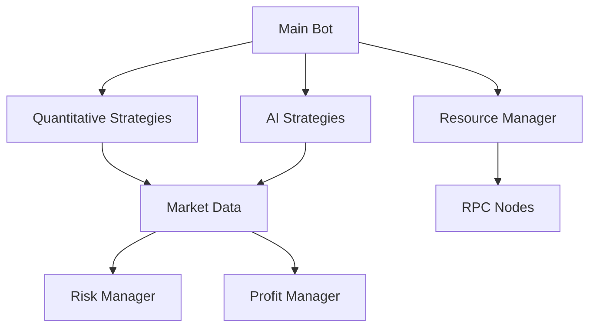

# Raydium AI Trading Bot with Advanced Scaling Framework

A sophisticated algorithmic trading bot for Raydium DEX on Solana, featuring AI-driven decision making, quantitative strategies, and dynamic resource scaling. Starting with just $50 initial capital, the bot implements institutional-grade trading techniques while maintaining minimal operational costs.

## Key Features

### 🚀 Scaling Framework
- **Resource Optimization**
  - Dynamic RPC node management (1-3 nodes)
  - Auto-scaling based on portfolio growth
  - Cost-optimized infrastructure ($50/month max)
  - Performance-based resource allocation

- **Portfolio Scaling**
  - Starts with $50 initial capital
  - Automated profit reinvestment
  - Dynamic position sizing
  - Growth-based strategy allocation

### 📈 Quantitative Strategies
- **High-Frequency Trading (HFT)**
  ```python
  async def execute_hft_strategy(
      self, 
      token_pair: str,
      order_book: Dict,
      market_data: Dict
  ) -> Optional[Dict]
  ```
  - Order book imbalance detection
  - Ultra-low latency execution
  - Dynamic spread capture
  - Minimal position hold time (0.5s)

- **Market Making**
  ```python
  async def execute_market_making(
      self,
      token_pair: str,
      order_book: Dict,
      market_data: Dict
  ) -> List[Dict]
  ```
  - Dynamic spread adjustment
  - Multi-level order grid
  - Volatility-based pricing
  - Risk-adjusted position sizes

- **Statistical Arbitrage**
  ```python
  async def execute_stat_arb(
      self,
      token_pairs: List[str],
      price_data: Dict[str, pd.DataFrame]
  ) -> Optional[Dict]
  ```
  - Correlation-based pair detection
  - Mean reversion trading
  - Z-score based signals
  - Cointegration analysis

### 🤖 AI-Driven Trading
- **Multi-Model Architecture**
  - LSTM price prediction
  - FinBERT sentiment analysis
  - Reinforcement learning adaptation
  - Whale wallet monitoring

- **Advanced Market Analysis**
  - Real-time order book analysis
  - Cross-exchange price monitoring
  - Volume profile analysis
  - Market impact estimation

### ⚡ Resource Management
- **Dynamic RPC Management**
  ```python
  @dataclass
  class ResourceConfig:
      max_monthly_budget: float = 50.0
      min_rpc_nodes: int = 1
      max_rpc_nodes: int = 3
      rpc_cost_per_node: float = 15.0
  ```
  - Cost-optimized node selection
  - Performance-based scaling
  - Latency optimization
  - Error rate monitoring

- **Infrastructure Scaling**
  - CPU/Memory optimization
  - Network latency management
  - Cost-based resource allocation
  - Automatic performance tuning

### 💰 Risk & Profit Management
- **Dynamic Risk Control**
  ```python
  @dataclass
  class RiskParameters:
      max_position_size: float = 0.2
      max_drawdown: float = 0.1
      max_daily_loss: float = 0.05
      max_leverage: float = 1.5
  ```
  - Position size optimization
  - Drawdown protection
  - Dynamic stop-loss adjustment
  - Portfolio correlation monitoring

- **Profit Optimization**
  ```python
  @dataclass
  class ProfitParameters:
      min_profit_threshold: float = 0.005
      reinvestment_ratio: float = 0.7
      profit_taking_intervals: List[float] = [0.01, 0.02, 0.05]
      compound_frequency: int = 3
  ```
  - Multi-level profit taking
  - Automated reinvestment
  - Compound interest optimization
  - Reserve pool management

## System Architecture

### Directory Structure
```
backend/
├── app/
│   ├── strategies/
│   │   ├── quantitative_strategies.py  # HFT & Market Making
│   │   ├── advanced_strategies.py      # AI-driven strategies
│   │   ├── risk_management.py         # Risk control system
│   │   └── profit_extraction.py       # Profit management
│   ├── infrastructure/
│   │   └── resource_manager.py        # Resource scaling
│   ├── analysis/
│   │   └── sentiment_analyzer.py      # Market sentiment
│   ├── data/
│   │   └── market_data.py            # Data pipeline
│   └── raydium_ai_bot.py             # Main bot implementation
```

### Component Interaction


## Scaling Phases

### 1. Initial Phase ($50-$100)
- Uses free RPC nodes
- Focuses on market making & HFT
- Minimal position sizes
- Conservative risk parameters

### 2. Growth Phase ($100-$500)
- Adds first paid RPC node
- Implements statistical arbitrage
- Increases position sizes
- Enables more strategies

### 3. Scaling Phase ($500+)
- Multiple RPC nodes
- Full strategy deployment
- Optimal position sizing
- Maximum efficiency

## Installation & Setup

1. Clone the repository:
```bash
git clone https://github.com/yourusername/raydium-ai-bot.git
cd raydium-ai-bot
```

2. Install dependencies:
```bash
poetry install
```

3. Configure environment:
```bash
cp .env.example .env
# Edit .env with your settings
```

### Configuration Parameters

#### Trading Parameters
```env
MIN_LIQUIDITY=1000
MIN_VOLUME=5000
MAX_SLIPPAGE=0.01
START_BALANCE=50
TRADE_SIZE_PERCENT=0.05
```

#### Risk Management
```env
MAX_POSITION_SIZE=0.2
MAX_DRAWDOWN=0.1
MAX_DAILY_LOSS=0.05
MAX_LEVERAGE=1.5
```

#### Resource Management
```env
MAX_MONTHLY_BUDGET=50
MIN_RPC_NODES=1
MAX_RPC_NODES=3
RPC_COST_PER_NODE=15
```

## Usage

1. Activate environment:
```bash
poetry shell
```

2. Start the bot:
```bash
python -m backend.app.raydium_ai_bot
```

## Performance Monitoring

The bot provides comprehensive performance tracking:

1. **Strategy Performance**
   - Per-strategy metrics
   - Win/loss ratios
   - Profit attribution
   - Risk-adjusted returns

2. **Resource Utilization**
   - RPC node performance
   - Cost optimization
   - Scaling efficiency
   - Infrastructure metrics

3. **Risk Metrics**
   - Drawdown monitoring
   - Position exposure
   - Correlation analysis
   - VaR calculations

## Cost Optimization

The bot implements several cost optimization strategies:

1. **RPC Usage**
   - Free node prioritization
   - Performance-based selection
   - Dynamic scaling
   - Cost-based routing

2. **Resource Allocation**
   - CPU/Memory optimization
   - Network usage management
   - Storage efficiency
   - Batch processing

3. **Infrastructure Costs**
   - Minimal initial setup
   - Growth-based scaling
   - Cost-based node selection
   - Resource pooling

## Contributing

1. Fork the repository
2. Create your feature branch
3. Commit your changes
4. Push to the branch
5. Create a Pull Request

## Testing

Run the test suite:
```bash
poetry run pytest
```

Run with coverage:
```bash
poetry run pytest --cov=backend
```

## Security

- Store API keys in `.env`
- Use environment variables
- Implement rate limiting
- Regular security audits

## Disclaimer

This bot is for educational purposes only. Cryptocurrency trading involves substantial risk of loss. Past performance does not guarantee future results. Use at your own risk.

## License

This project is licensed under the MIT License - see the LICENSE file for details. 