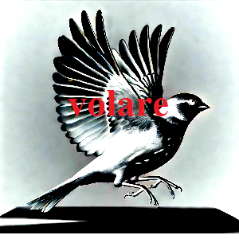

# Volare - Elevate Your Trading

<div align="center">
  
  <br>
  <strong>Institutional-Grade Trading for Everyone</strong>
  <br>
  <em>Start small, learn to fly</em>
</div>

<p align="center">
  <a href="https://github.com/yanvlachakis/Volare/blob/main/LICENSE">
    
  </a>
  <a href="https://github.com/yanvlachakis/Volare/stargazers">
    
  </a>
  <a href="https://discord.gg/volare-trading">
    
  </a>
  <a href="https://t.me/volare_trading">
    
  </a>
</p>

## 🚀 Vision

Volare (Italian for "to fly") empowers traders to soar from modest beginnings to institutional-grade performance. Our AI-driven platform implements sophisticated trading strategies while maintaining minimal operational costs, allows even the most humble portfolio to grow on a budget.

## ✨ Key Features

### 💡 Smart Capital Utilization
- Start trading with just $50
- Maximum monthly overhead of $50
- Automated profit reinvestment
- Dynamic position sizing

### 🤖 Advanced Trading Strategies
- **High-Frequency Trading (HFT)**
  - Ultra-low latency execution
  - Order book imbalance detection
  - Dynamic spread capture
  
- **Market Making**
  - Adaptive spread management
  - Multi-level order grid
  - Volatility-based pricing
  
- **Statistical Arbitrage**
  - Correlation-based pair detection
  - Mean reversion trading
  - Real-time cointegration analysis
  
- **AI-Driven Trading**
  - LSTM price prediction
  - Sentiment analysis
  - Whale activity monitoring

### ⚡ Intelligent Scaling
- Dynamic RPC node management
- Performance-based resource allocation
- Cost-optimized infrastructure
- Growth-driven strategy deployment

## 🛠 Quick Start

### Prerequisites
```bash
Python 3.8+
Poetry
Solana Wallet
```

### Installation
```bash
# Clone repository
git clone https://github.com/yanvlachakis/Volare.git
cd Volare

# Install dependencies
poetry install

# Configure environment
cp .env.example .env
# Edit .env with your settings
```

### Launch
```bash
poetry run python -m backend.app.raydium_ai_bot
```

## 📊 Performance Dashboard

Access real-time performance metrics at `http://localhost:8000`:

- Portfolio value and returns
- Strategy performance
- Resource utilization
- Cost monitoring
- Real-time alerts

## 🔄 Trading Lifecycle

1. **Market Analysis**
   - Order book analysis
   - Sentiment evaluation
   - Volatility assessment
   - Liquidity monitoring

2. **Strategy Selection**
   - Dynamic strategy allocation
   - Performance-based adjustment
   - Risk-aware execution
   - Cost optimization

3. **Trade Execution**
   - Smart order routing
   - Slippage optimization
   - Position management
   - Risk monitoring

## 🛡 Risk Management

- Dynamic position sizing
- Multi-level stop losses
- Portfolio correlation monitoring
- Drawdown protection
- Real-time risk alerts

## 💰 Cost Optimization

- Free RPC node prioritization
- Dynamic resource scaling
- Batch processing optimization
- Efficient data structures
- Smart caching strategies

## 🔐 Security

- Secure API key management
- Rate limiting
- DDoS protection
- Regular security audits
- Comprehensive error handling

## 📈 Growth Phases

### 1. Launch ($50-$100)
- Free RPC nodes
- Basic strategy deployment
- Conservative position sizing
- Risk-minimized approach

### 2. Growth ($100-$500)
- Premium RPC access
- Strategy expansion
- Increased position sizes
- Enhanced monitoring

### 3. Scale ($500+)
- Multi-node deployment
- Full strategy suite
- Optimal position sizing
- Maximum efficiency

## 🤝 Contributing

We welcome contributions! Please see our [Contributing Guidelines](CONTRIBUTING.md) for details.

### Development Setup
```bash
# Create development environment
poetry install --with dev

# Run tests
poetry run pytest

# Run linting
poetry run flake8
poetry run mypy .
```

## 📚 Documentation

- [Quantitative Strategies](docs/quantitative_strategies.md)
- [AI Strategies](docs/ai_strategies.md)
- [Resource Management](docs/resource_management.md)
- [API Documentation](docs/api.md)

## 🌐 Community

- [Discord](https://discord.gg/volare-trading)
- [Telegram](https://t.me/volare_trading)
- [Documentation](https://docs.volare-trading.com)
- [Blog](https://blog.volare-trading.com)

## ⚠️ Disclaimer

Volare is for educational purposes only. Cryptocurrency trading involves substantial risk of loss. Past performance does not guarantee future results. Use at your own risk.

## 📄 License

This project is licensed under the MIT License - see the [LICENSE](LICENSE) file for details. 