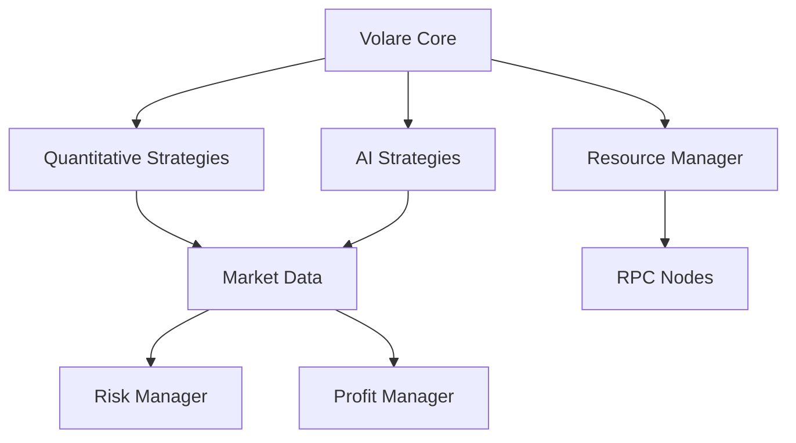

# Volare Trading Framework


## Overview

Volare is an institutional-grade algorithmic trading framework for the Solana blockchain, designed to scale from a minimal initial investment. The framework combines high-frequency trading, AI-driven strategies, and dynamic resource scaling to achieve optimal performance while maintaining low operational costs.

> *"Volare" - Italian for "to fly"*

## Key Features

### 🚀 Minimal to Scale
- Start with just $50 initial capital
- Scale automatically with portfolio growth
- Maintain low operational costs ($50/month max)
- Dynamic resource optimization

### 💹 Advanced Trading Strategies
- High-Frequency Trading (HFT)
- AI-driven market prediction
- Statistical arbitrage
- Dynamic market making

### ⚡ Intelligent Scaling
- Automatic RPC node management
- Performance-based resource allocation
- Cost-optimized infrastructure
- Growth-driven strategy deployment

## Core Documentation

### Trading Strategies
- [Quantitative Strategies](quantitative_strategies.md)
  - High-Frequency Trading (HFT)
  - Market Making
  - Statistical Arbitrage

- [AI-Driven Strategies](ai_strategies.md)
  - LSTM Price Prediction
  - Sentiment Analysis
  - Reinforcement Learning
  - Market Analysis

### Infrastructure
- [Resource Management](resource_management.md)
  - RPC Node Management
  - Cost Optimization
  - Performance Optimization
  - Scaling Implementation

## Quick Start

### Prerequisites
- Python 3.8+
- Poetry for dependency management
- Solana wallet
- Basic RPC node access

### Installation
```bash
# Clone repository
git clone https://github.com/volare-trading/volare-framework.git
cd volare-framework

# Install dependencies
poetry install

# Configure environment
cp .env.example .env
# Edit .env with your settings
```

### Basic Configuration
```env
# Trading Parameters
MIN_LIQUIDITY=1000
MIN_VOLUME=5000
START_BALANCE=50

# Resource Management
MAX_MONTHLY_BUDGET=50
MIN_RPC_NODES=1
```

### Launch
```bash
poetry run python -m volare.bot
```

## Architecture

### Component Overview


## Growth Phases

### 1. Launch Phase ($50-$100)
- Free RPC nodes
- HFT & market making focus
- Conservative position sizing
- Risk-minimized strategies

### 2. Growth Phase ($100-$500)
- First paid RPC node
- Statistical arbitrage
- Increased position sizes
- Strategy expansion

### 3. Scale Phase ($500+)
- Multi-node deployment
- Full strategy suite
- Optimal sizing
- Maximum efficiency

## Contributing

We welcome contributions! Please see our [Contributing Guidelines](CONTRIBUTING.md) for details.

### Development Setup
```bash
# Create development environment
poetry install --with dev

# Run tests
poetry run pytest

# Run linting
poetry run flake8
poetry run mypy .
```

### Pull Request Process
1. Fork the repository
2. Create feature branch
3. Commit changes
4. Push to branch
5. Submit pull request

## Community

- [Discord Server](https://discord.gg/volare-trading)
- [Telegram Group](https://t.me/volare_trading)
- [Documentation](https://docs.volare-trading.com)
- [GitHub Issues](https://github.com/volare-trading/volare-framework/issues)

## Security

Please report security vulnerabilities to security@volare-trading.com

- Store API keys in `.env`
- Use environment variables
- Implement rate limiting
- Regular security audits

## License

This project is licensed under the MIT License - see the [LICENSE](LICENSE) file for details.

## Disclaimer

Volare is for educational purposes only. Cryptocurrency trading involves substantial risk of loss. Past performance does not guarantee future results. Use at your own risk. 